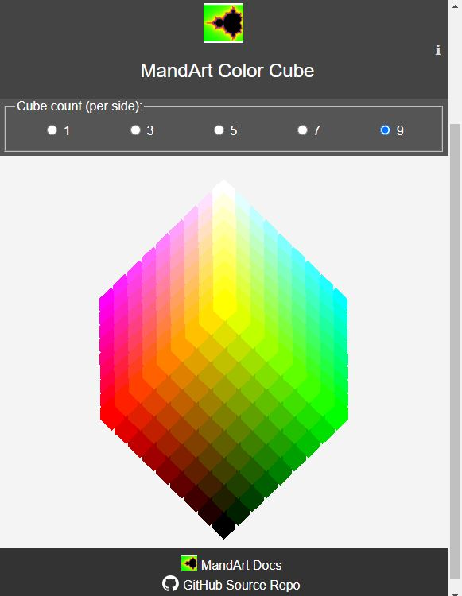
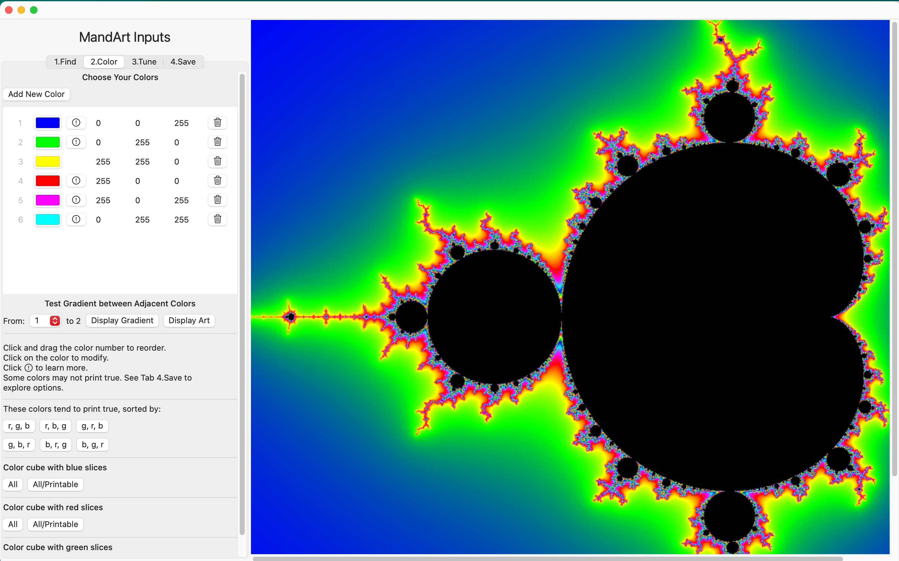

# MandArt Color Cube

> A tool for selecting attractive color gradients for MandArt.

## Introduction to MandArt Coloring

MandArt is a digital art form that uses the Mandelbrot Set to create unique artwork.
In MandArt, the colors in your selected color list will be blended and will flow from one adjacent color to the next over a gradient.
Each color gradient will transition along a straight line between those two colors on the color cube.
Your color list and the associated gradients contribute significantly to the overall appearance of your artwork.

  

**Note**: Selecting two adjacent colors on opposite sides of the color cube may lead to a gray transition in the gradient. You may wish to select colors that are not connected by a straight line through the center of the cube.

## Selecting Colors in MandArt

When creating in MandArt, you select colors with a color picker, that includes an eye dropper tool.
The eye dropper tool allows you to select any color on your screen.
You can use the eye dropper to select colors from the color cube.

**How to Use The Color Cube with MandArt:**

1. Observe the cube to understand the straight line path between different colors.
2. Choose adjacent colors with a pleasing transition along that straight line.
3. Avoid paths that cross the cube's center to steer clear of gray tones.

Learn more about [Selecting Colors in MandArt](https://denisecase.github.io/MandArt-Docs/documentation/mandart/b2-color).

## Color Cube Links

- [Color Cube App](https://denisecase.github.io/color-cube/)
- [Color Cube GitHub Source](https://github.com/denisecase/color-cube)

## MandArt Resources

- [MandArt (App Store)](https://apps.apple.com/us/app/mandart/id6445924588?mt=12) - runs on MacOS (v12+) - _Released!_
- [MandArt Documentation](https://denisecase.github.io/MandArt-Docs/documentation/mandart/)
- [MandArt Discoveries](https://github.com/denisecase/MandArt-Discoveries/)

