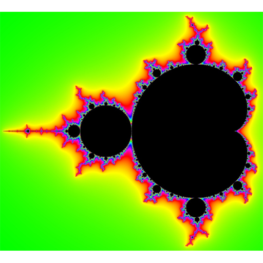

# color-cube

> 3D Color Cube for MandArt

## MandArt Coloring

MandArt is a digital art form that uses the Mandelbrot Set to create unique artwork.
The colors you choose will be blended using a color gradient between each two adjacent colors.
These intermediate colors will appear in your MandArt.

If you pick any two adjacent colors that could be connected by a line that goes through the center of the cube,
you're likely to get gray in the color gradient, which might not make the best color for your art.

## Selecting Colors in MandArt

When creating in MandArt, you select colors using a MandArt color picker.
The color picker has an eye dropper tool that lets you select any color showing on your screen.

## Using the Color Cube

This color cube is a tool to help you select colors for your MandArt.
By viewing this cube, you can see the colors that will be blended between two colors you select.
Choose a good path between adjacent colors that pass through colors you'd like to see in your MandArt.
Learn more about [Choosing Colors](https://denisecase.github.io/MandArt-Docs/documentation/mandart/b2-color).

## Links

- View the [Color Cube Demo](https://denisecase.github.io/color-cube/)
- Source code at [GitHub](https://github.com/denisecase/color-cube)

## MandArt Links

- [MandArt (App Store)](https://apps.apple.com/us/app/mandart/id6445924588?mt=12) - runs on MacOS (v12+) - _Released!_
- [MandArt-Docs](https://denisecase.github.io/MandArt-Docs/documentation/mandart/)
- [MandArt-Discoveries](https://github.com/denisecase/MandArt-Discoveries/)

